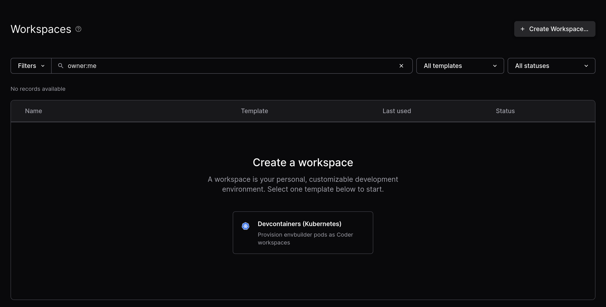
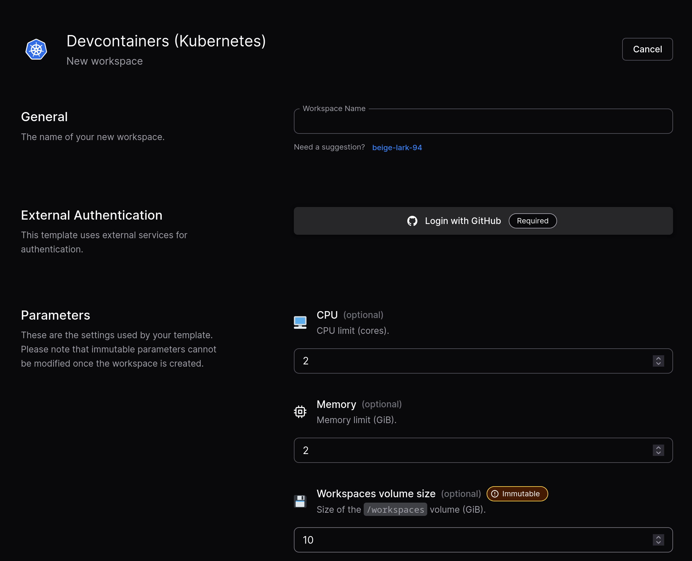
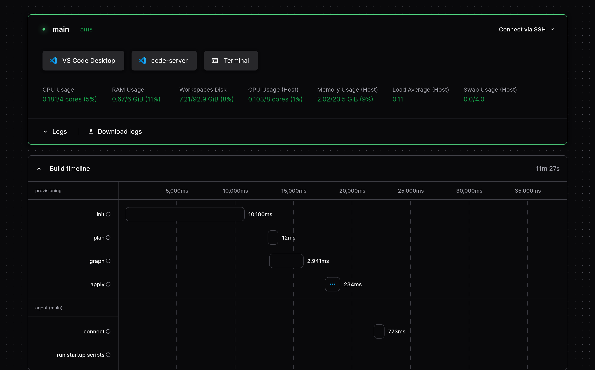
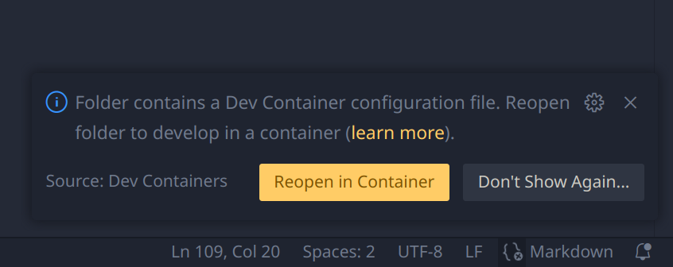

# TSMC CareerHack 2025

[Hackmd Note](https://hackmd.io/@gary940610/H1jqhXXFyl)

## Detailed Scoring Criteria

### System Architecture (30%)
- 依照架構圖發表為何如此設計
  1. 系統架構
  2. 創建使用者與資料授權設計（ex. 使用者只能看到某些公司的資料）
  3. AI Agent Processing Graph（查詢/計算數值型指標、歷年財務轉換、資料摘要等等）
  4. 避免資料幻覺

**2/15 HackDay 呈現方式：Presentation**

---

### Data Trustworthiness (30%)
- [ ] **模型支援多語系**
- [ ] **資料授權設計**（Role: 參考 workshop 投影片）
- [ ] **資料視覺化**（根據數值資料畫折線圖）
- [ ] **搜尋單一公司的財報指標與逐字稿內容**
- [ ] **跨公司的財務比較與財報指標逐字稿內容**
- [ ] **歷年財務的轉換**（參考 workshop 投影片）
- [ ] **正確的幣值轉換**（幣值轉換基準: 參考 workshop 投影片）
- [ ] **計算更多的財務指標**（財務公式: 參考 workshop 投影片）
  - 毛利率
  - 營業利益率

**2/15 HackDay 呈現方式：Questions with Chatbot**

---

### Data Summarization (15%)
- [ ] **資料範圍**：逐字稿、數值型財務指標
- [ ] **題目**：歷年季度 + 公司名稱
- [ ] **由系統生成摘要報告**，內容可自由發揮，建議方向（不限）：
   - 財務數據趨勢
   - 產品策略
   - 市場競合
   - 未來展望（可讀性 / 資料視覺化）

**2/15 HackDay 呈現方式：Presentation**

---

### User Experience & UI Friendliness (15%)
1. **前端互動的介面**
2. **資料視覺化、資料標註**

**2/15 HackDay 呈現方式：Live demo & presentation**

---

### Bonus (10%)
- 其他功能、創意

**2/15 HackDay 呈現方式：Live demo & presentation**

## Development(coder)

### Prerequisites

Just a working browser!

### Getting Started

1. go to http://coder.ccns.easonabc.eu.org

2. login with password from user's email

3. You will be greet with create a workspace

4. create a workspace by clicking pre-defined template(`Decontainer (Kubernetes)`)

5. Fill Form with following info

| column | value | note |
| :- | :- | :- |
|Workspace Name|maroon-toad-33|Anything you like|
|Repository (auto)|https://github.com/icannon2/tsmc2025.git|It must be http|

> [!IMPORTANT]  
> When using private repository, you must be authenticated using button(it invoke oauth).

6. Wait for its creation, then click `code-server` for vscode in browser.

7. Happy coding! 🎉

## Development Environment Setup(Local)

We will guide you through setting up your development environment using a dev container. A dev container simplifies the setup process and ensures that you have a consistent development environment.

### Prerequisites

> [!NOTE]  
> Docker is extreme difficult to install on Windows, using coder might save your time if WSL is not installed!

Before you get started, make sure you have the following installed on your machine:

- [Visual Studio Code](https://code.visualstudio.com/)
- [Docker](https://www.docker.com/get-started)
- [Remote - Containers Extension](https://marketplace.visualstudio.com/items?itemName=ms-vscode-remote.remote-containers)

### Getting Started

1. Open the project in vscode.

2. Click `reopen in container`.

3. Wait for container to be ready

4. Happy coding! 🎉
